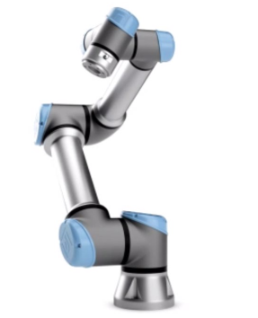
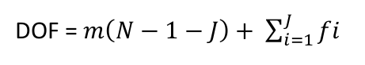
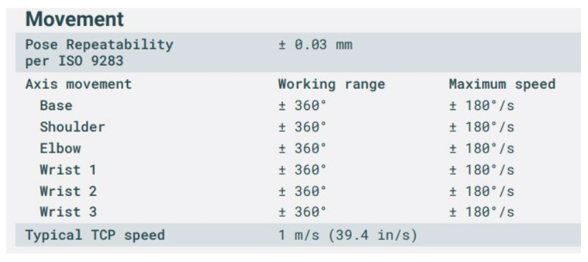
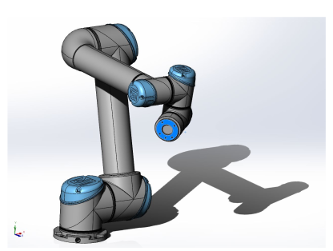
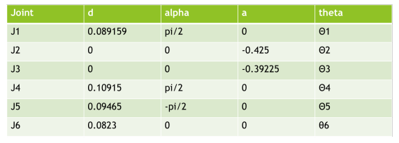
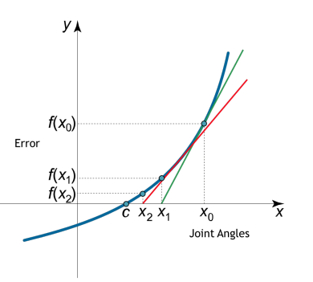
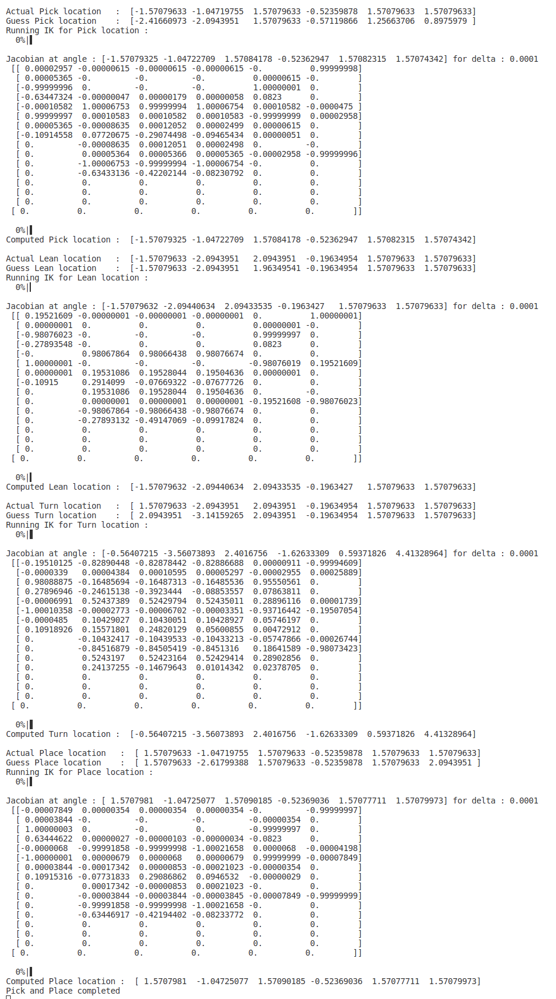
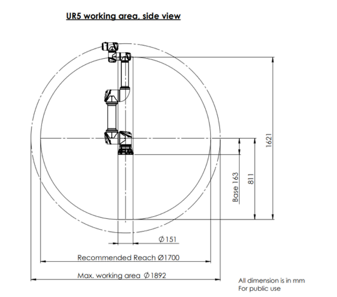
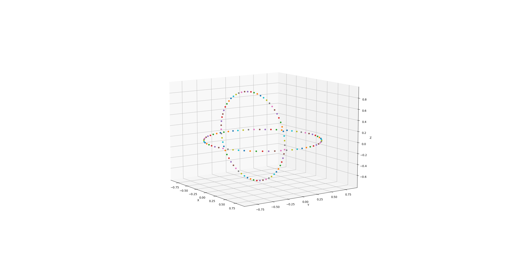

[](https://opensource.org/licenses/MIT)
[](https://opensource.org/licenses/BSD-2-Clause)
---
# Hardware Implementation of Pick & Place Operation using UR5e

## Disclaimer
 - License: BSD & MIT
 - License File: LICENSE (in the project directory)

## Project Overview and Description:
 - The main objective of this project is to implement an application based on basic pick and place operation using the Universal UR5e manipulator in the Robot Realisation Laboratory.
 - Utilising the core concepts from the ‘Introduction to Robot Modelling’ course, it is agreed among the team members to explore these concepts in a real-world hardware application.
 - Upon several discussions with Prof.Reza Monfaredi and evaluating different available options at the University of Maryland labs, it is narrowed down to utilise Universal Robot’s UR5e manipulator, a flexible robotic arm, to implement ‘pick and place’ application.

<p align="center">
  
</p>


## Purpose of the Project:
 - The scope of the project is to implement an application based on pick and place operation using the UR5e robotic arm, utilising the concepts of forward kinematics, inverse kinematics, and the tools such as Solidworks, Gazebo and ROS.
 - Here the inverse kinematic and forward kinematics of the robot may be studied and explored.
 - Gazebo implementation of pick and place may be performed using SOLIDWORKS model and our own ROS package.
 - Deploy the parameters derived for IK and FK on the official ROS package on real hardware UR5e in RRL.

## Personnel:
 - Dhinesh Rajasekaran 
    - UID: 119400241
 - Tej Kiran
    - UID: 119197066
 - Arshad Shaik
    - UID: 118438832

## Guidance:
 - Dr. Reza Monfaredi & support from TAs for ENPM-662 course
    - Pavan Mantripragada
    - Adarsh Malapaka

## Application:
 - The project will implement the basic pick and place operation for the given co-ordinates of the end-effector. The ambitious and the fallback goals of the above application are described as below:

 - Ambitious Goal:
    - Check availability of the end effector and move the robot arm to desired waypoints in the 3D space, to perform an operation such as pick and place, hook etc.
    - In the event of its availability of end-effector, basic pick and place of some objects placed in given waypoints may be performed or any othe application based on prof recommendation.
    - The object location and its desired end location will be given, UR5e will reach the initial location, grab the object, and place it in the given desired location.

 - Fall Back Goals:
    - Simulation of UR5e in gazebo world with custom designed world in Gazebo with our own ROS package.
    - Implement basic movement of UR5e hardware in RRL where the robot may reach a given start location from any random arbitrary location and then move to a given end/desired location without any pick and place of objects.

## Folder Structure:
 - "Pre-Proposal" folder contains the project pre-proposal (word & PDF).
     - [click here to view the file](./Pre-Proposal)
 - "Proposal folder" contains the project proposal (word & PDF).
     - [click here to view the file](./Proposal)
 - "readme_image" folder contains the readme images.
     - [click here to view the file](./readme_image)
 - "Report" folder contains the project report (word & PDF)
     - [click here to view the file](./Report)
 - "results" folder contains project demo videos
     - [click here to view the file](./results)
 - "src" folder contains the ROS packages
     - [click here to view the file](./src)
 - "UR5_Model" folder contains the SOLIDWORKS model developed
     - [click here to view the file](./UR5_Model)
 - "PPT_Final Project" is the final presentation given in class
     - [click here to view the file](./PPT_Final%20Project.pptx)

## ROS Packages:
 - "robot_params.py" - python program containing the DH table and a class to access the DH table data.
     - [click here to view the file](src/ur5v1/src/robot_params.py)
 - "utilities.py" - python program containing the FK calc method.
     - [click here to view the file](src/ur5v1/src/utilities.py)
 - "pick_place_moveit_joint_control.cpp" - move group c++ interface for pick & place operation using the angles generated using our IK, calls the planner and passes the goal pose defined in moveit package.
     - [click here to view the file](src/ur5v1/src/pick_place_moveit_joint_control.cpp)
 - "pick_and_place.py" - python program which does pick & place operation using our own IK in Gazebo. (same as prev file but doesn't use moveit, directly passes the value to gazebo for action)
     - [click here to view the file](src/ur5v1/src/pick_and_place.py)
 - "IK_Nemerical_DH.py" - python program which has the IK solver using Newton - Rapson method.
     - [click here to view the file](src/ur5v1/src/IK_Nemerical_DH.py)
 - "robot_joint_publisher.py" - python program which publishes the joint angles computed for Gazebo simulation.
     - [click here to view the file](src/ur5v1/src/robot_joint_publisher.py) 

## Instructions to run the package:
Run the following commands in order: <br/>
Clone Repo and Build
 ```
 git clone https://github.com/stark-2000/UR5_Pick-Place_Hardware.git
 cd UR5_Pick-Place_Hardware
 catkin_make
 ```
Run Rviz simulation - Pick & Place
 ```
 source ./devel/setup.bash
 roslaunch ur5_moveit demo.launch
 ```
 - Open new terminal and run below command
 ```
 source ./devel/setup.bash
 rosrun ur5v1 pick_place_moveit_joint_control
 ```
Run Gazebo simulation - Pick & Place
 ```
 source ./devel/setup.bash
 roslaunch ur5v1 control.launch
 ```
Click play button in Gazebo and open new terminal & run below command
```
python3 ./src/ur5v1/src/pick_and_place.py
```

## DOF and Dimensions: 



- Number of Links N = 6
- Number of Joints J = 5
- DOF in 3-D space m = 6
- DoF = 6(6-1-5) + 5 * 1 = 5

<p align="center">
  
</p>


## CAD Model:




## DH Table:




## Inverse Kinematics:
 - Inverse Kinematics gives us a method for finding the joint angles given an end effector configuration This can sometimes be done analytically (geometrically), but this is often difficult.
 - Hence, a numerical method - Newton-Raphson method – has been used for inverse kinematics.

 - Inverse kinematics problem can be viewed as finding roots of a nonlinear equation: T(θ) = X
 - Many numerical methods exist for finding roots of nonlinear equations. The standard Newton-Raphson method for solving x = f(θ), where θ ∈ Rn and x ∈ Rm.

<p align="center">
  
</p>


 - Joint update equation is (Newton – Raphson method):
    - q = q + step*deltaq
    - deltaq = jacobian * ΔError (as end effector Transformation Matrix Difference)
    - Jacobian = error gradient between q± Δ (as end effector Transformation Matrix Difference)
    - Damped Least Squares update is Δq = J.T * Pinv(J*J.T + λ*I) * ΔError

 - The screenshot below is the final jacobian matrix output at each pose of the pick & place action of UR5e:

<p align="center">
  
</p>


## Workspace Study:
 - The workspace of a UR arm is spherical, and in the working area diagrams it’s represented with two concentric circles, a smaller one labelled “Recommended Reach” and a slightly larger one labelled “Max. working area”. In the centre of the workspace, directly above and below the base joint there is a column, inside which there are also some restrictions on robot movement.
 - The example below is from the UR5e robot working area diagram that can be found here:

<p align="center">
  
</p>


 - The figure below is the plot output of UR5e - rough reachable workspace plotted using final transformation matrix FK (a sphere is enclosed or formed by the 2 circles plotted which is roughly the working area of UR5e): 

<p align="center">
  
</p>


## Assumptions:
 - The following assumptions are made during the execution of the project.
    - Numerical Inverse Kinematics calculation requires an initial guess which can be solved using a planner in real world applications.
    - Joint constraints are ignored in IK calculation.
    - Environmental/workspace constraints will be handled by the planner.
    - Numerical Inverse Kinematics will converge in real time.

## Gazebo & RViz Simulation: 
 - The simulation video demonstrating application in Gazebo directly run from python file is archived in the folder – ‘Results’ in the main branch. See the below video.

https://user-images.githubusercontent.com/78305300/206824643-dc5ea155-37e7-467e-b75f-5fbe8dc0bc2d.mp4


 - The simulation video demonstrating the application of ‘MoveIt’ ROS package in Rviz, utilising our own developed IK plugin, are archived in the folder ‘results’ in main branch. See the below video.

https://user-images.githubusercontent.com/78305300/227697069-10c5ae4b-b32f-4da9-9055-1095e7ee510a.mp4


## Implementation on real hardware – UR5e:
 - The forward and inverse kinematics, developed above, are implemented on real hardware – UR5e in the [Robotics Realization Laboratory](https://robotics.umd.edu/facilities/robotics-realization-laboratory) and validated against the expected results as shown in the above simulation videos.
 - The following is a short demo video of the robot in action:
 
https://user-images.githubusercontent.com/78305300/227679797-3db5f40e-7369-4dbe-9113-9ed7b1362082.mp4

<p>
</p>

<p>
</p>

 - The following is the full demo video on the real hardware which includes prepration, safety check and execution:
  
https://user-images.githubusercontent.com/78305300/227688937-83490556-aa12-4856-8848-f73e294155ce.mp4
